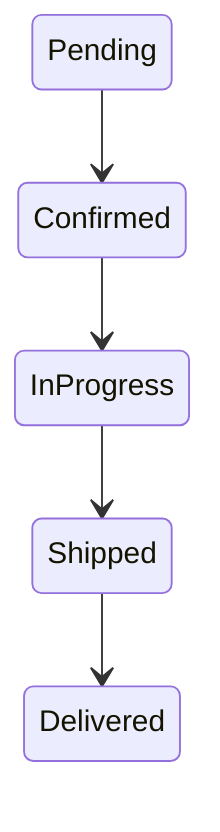

# Week 6 — The Supply Chain (Part 1): Two Apps Talking

## Provider-App Implementation Assessment

Based on a review of the provider-app directory against this PRD:


## What You Build This Week

A factory does not exist in isolation. It buys parts from suppliers. Your Week 5 app already models the factory. This week you build the **provider** — a separate piece of software that sells parts — and you teach the manufacturer how to buy from it over a REST API.

By the end of today’s session you must be able to:

1. Start both apps on different ports
2. Use the provider’s CLI to inspect its catalog and stock
3. From the manufacturer (CLI or API), place a purchase order with the provider
4. Advance time on both apps and see the order move through `pending → shipped → delivered`
5. Verify the parts arrived in the manufacturer’s inventory and were logged in both databases

**No agents yet. No turn engine yet.** A human drives each app manually. This is the deterministic foundation: if this is not rock solid, nothing on top of it will be.

---

## Part 1: Core Concepts

### Multi-Service Architecture

Until now your Week 5 project was one app: one database, one process, one UI. From this week on you are building a **distributed system** — multiple processes, each with its own state, communicating over the network.

**Why separate processes instead of one big app?**

- **Isolation**: the provider’s bugs should not crash the manufacturer
- **Independence**: each service can be built and deployed by a different team
- **Clarity**: the boundary forces you to design a real contract between them
- **Realism**: this is how real organisations work — separate systems, separate databases, APIs in between

The cost is complexity: you now have to manage ports, handle network errors, and keep simulated time consistent across processes.

### REST as a Contract

When the manufacturer calls the provider, it does not reach into the provider’s database. It sends an HTTP request to a well-defined endpoint. The provider decides what to do and responds. This is a **contract**. Neither side trusts the other’s internals.

The contract is documented — in your case, via FastAPI’s automatic Swagger/OpenAPI page at `/docs`.

### CLI Design: Consistency Across Apps

Every app in this project will have a CLI. Agents (next week) and humans (this week) use the CLI to interact with an app.

**Recommended pattern** (using typer or click):

```bash
provider-cli catalog          # list resource
provider-cli stock            # list resource
provider-cli orders list      # list sub-resource
provider-cli orders show      # read specific
provider-cli price set        # mutate
provider-cli day advance      # action verb
```

Decide your convention now. Stick to it across all three apps.

### Event Logs as Audit Trail

Every meaningful state change in every app must be written to an `events` table. This is your audit trail — and later, your data lake for analysis.

```sql
CREATE TABLE events (
    id INTEGER PRIMARY KEY AUTOINCREMENT,
    sim_day INTEGER NOT NULL,
    event_type TEXT NOT NULL,
    entity_type TEXT,
    entity_id INTEGER,
    detail TEXT,
    created_at TIMESTAMP DEFAULT CURRENT_TIMESTAMP
);
```

Event types: `order_placed`, `order_shipped`, `order_delivered`, `price_changed`, `stock_updated`, `day_advanced`.

### Simulated Time

Each app owns a counter: the current simulated day. When you call `day advance`, the app processes everything that should happen during one day and increments its counter.

For this week: a human advances each app one at a time, in the same order, every day.

---

## Part 2: The Supply Chain (Scoped to This Week)

Retailers and end customers are next week. For now, ignore them entirely.

### The Order Lifecycle

All orders share the same state machine:



Design your code so this state machine is explicit (Enum values + explicit transitions).

### The Ironclad Rule

**Parts ordered today cannot arrive today.** Minimum lead time is 1 day. This creates the tension the whole simulation depends on.

---

## Part 3: The Provider App (Full Spec)

### Data Model

- Products catalog
- Pricing tiers (quantity-based)
- Lead times per product
- Stock levels
- Orders with full history and status

### CLI Commands

- `provider-cli catalog`
- `provider-cli stock`
- `provider-cli orders list [--status]`
- `provider-cli orders show <id>`
- `provider-cli price set`
- `provider-cli restock`
- `provider-cli day advance`
- `provider-cli day current`
- `provider-cli export` / `import`
- `provider-cli serve --port 8001`

### REST Endpoints

- `GET /api/catalog`
- `GET /api/stock`
- `POST /api/orders`
- `GET /api/orders`
- `GET /api/orders/{id}`
- `POST /api/day/advance`
- `GET /api/day/current`

### Key Behaviour

- Placing an order: check stock, compute tiered price, calculate expected delivery, create pending order.
- Advancing a day: process deliveries, update statuses, increment day, log events.

### Suggested Database Schema

(Full schema provided in original text — use the one with `products`, `pricing_tiers`, `stock`, `orders`, `events`, `sim_state`)

### Seed Data

Create `seed-provider.json` with products, pricing tiers, and initial stock.

---

## Part 4: Adapting the Manufacturer App

Required changes:

1. Config file with provider URLs
2. New CLI commands for suppliers and purchases
3. Track purchase orders locally
4. Poll provider during `day advance` to receive deliveries
5. Keep existing Week 5 functionality intact

---

## Part 5: The Manual Scenario

Detailed 5-day end-to-end scenario (setup on day 0 → order placement → delivery on day 4 → verification). You must be able to run this cleanly.

---

## Part 6: Verification Checklist

(Full checklist included — use it before committing)

---

## Part 7: Deliverables

1. GitHub Repository (structure, files, README)
2. Short Report (2–3 pages PDF from Markdown)
3. Live Demo of the 5-day scenario

---

## Part 8: Technical Reference

- Typer CLI pattern example
- FastAPI skeleton
- Service layer recommendation (separate from CLI/API)
- HTTP client example with `httpx`
- Security best practices (`.env`, `.gitignore`)

---

**Summary**

This week’s goal: Prove that two separate apps can share a coherent simulated world through a clean REST contract. Get this foundation right.

