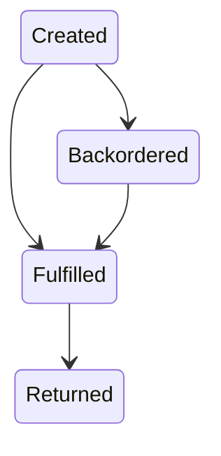
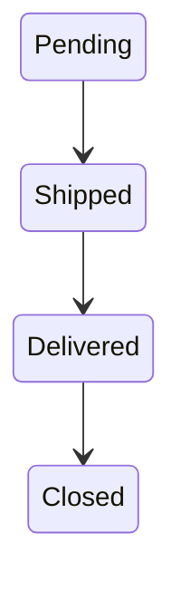

# Week 7 — The Retailer App: Completing the Supply Chain

## Retailer-App Implementation Specification

The retailer sits at the end of the supply chain. It buys finished printers from the manufacturer, holds inventory, receives customer demand, and sells products to end customers while maintaining pricing rules and a reliable order fulfillment process.

This document defines the retailer app requirements, data model, CLI, REST contract, and expected behavior.

---

## Part 1: Purpose

A retailer app must operate as an independent service with its own state and audit log. Its primary responsibilities are:

- maintain a catalog of finished printer models
- handle customer orders and returns
- manage stock levels and purchase orders from the manufacturer
- enforce minimum margin pricing
- publish events for every state-changing action
- advance simulated days on its own clock

The retailer is a separate process from the factory and provider. It talks to the manufacturer over REST and must be able to run multiple instances with different configuration files.

---

## Part 2: The Retailer App (Full Spec)

### Data Model

The retailer app must include these core entities:

- **Catalog**: available finished products and retail prices
- **Customer orders**: ordered by end customers with status tracking
- **Purchase orders**: orders placed with the manufacturer for replenishment
- **Stock**: current inventory of finished goods
- **Sales history**: fulfilled orders, revenue, and margins
- **Events**: audit log for every operation

### Expected Entities

| Entity | Purpose | Key Fields |
|---|---|---|
| `Product` | Retail catalog item | `id`, `name`, `model`, `base_price`, `retail_price`, `manufacturer_price` |
| `CustomerOrder` | End-customer purchase | `id`, `customer_name`, `product_id`, `quantity`, `status`, `created_day`, `fulfilled_day` |
| `PurchaseOrder` | Replenishment order to manufacturer | `id`, `product_id`, `quantity`, `issue_day`, `expected_delivery_day`, `status` |
| `Stock` | Inventory snapshot | `product_id`, `quantity_available`, `quantity_on_hold` |
| `Sale` | History of completed customer transactions | `id`, `order_id`, `product_id`, `quantity`, `sales_price`, `margin_pct`, `completed_day` |
| `Event` | Audit record | `id`, `sim_day`, `event_type`, `entity_type`, `entity_id`, `details` |

### Order State Machine

Customer orders must follow an explicit state machine:



Purchase orders should also track lifecycle:



---

## CLI Commands

The retailer CLI must expose the following commands:

```bash
retailer-cli catalog
retailer-cli stock
retailer-cli customers orders [--status]
retailer-cli customers order <order_id>
retailer-cli fulfill <order_id>
retailer-cli backorder <order_id>
retailer-cli purchase list
retailer-cli purchase create <model> <qty>
retailer-cli price set <model> <price>
retailer-cli day advance
retailer-cli day current
retailer-cli export
retailer-cli import <file>
retailer-cli serve --port 8003
```

### Command semantics

- `catalog`: list available products with retail and wholesale prices
- `stock`: show current inventory levels and backorder queues
- `customers orders`: list customer orders, filterable by status
- `customers order`: display a specific customer order detail
- `fulfill`: attempt to ship a customer order from stock
- `backorder`: mark a customer order as backordered when stock is unavailable
- `purchase list`: show pending purchase orders to the manufacturer
- `purchase create`: create a new purchase order for a finished model
- `price set`: change the retail price for a product while enforcing margin rules
- `day advance`: advance the retailer clock and process incoming shipments/backorder fulfillment
- `day current`: display the current simulated day
- `export` / `import`: dump and restore full simulation state
- `serve`: run the FastAPI server on the configured port

---

## REST Endpoints

The retailer API must provide a complete HTTP contract for the above features.

### Required endpoints

- `GET /api/catalog`
- `GET /api/stock`
- `POST /api/orders`
- `GET /api/orders`
- `GET /api/orders/{id}`
- `POST /api/orders/{id}/fulfill`
- `POST /api/orders/{id}/backorder`
- `POST /api/purchases`
- `GET /api/purchases`
- `GET /api/purchases/{id}`
- `GET /api/day/current`
- `POST /api/day/advance`
- `GET /api/state/export`
- `POST /api/state/import`

### API behavior expectations

- Create customer orders via `POST /api/orders`
- Fulfill orders from stock if available
- Move customer orders to backordered status if stock is insufficient
- Create purchase orders to the manufacturer via `POST /api/purchases`
- Expose current day and inventory through API
- Support consistent response schemas and OpenAPI docs

---

## Key Behaviour

The retailer app must implement these business rules:

- **Fulfill from stock if available, otherwise backorder**
- **Auto-fulfill backorders on day advance** when stock arrives
- **Poll the manufacturer for incoming shipments** during day advance
- **Enforce minimum price floor**: retail price must remain at least manufacturer wholesale cost + 15% margin
- **Track sales history** for every fulfilled order, including unit sale price and effective margin
- **Record events** for all state changes, including order creation, fulfillment, backorders, purchase order placement, receipt, price changes, and day advancement
- **Support multiple retailer instances** with isolated configuration and ports

### Shipping and replenishment

- Customer orders placed on the same day should not be fulfilled from manufacturer shipments arriving the same day unless the manufacturer explicitly delivered them before the retailer advances.
- Purchase orders are issued to the manufacturer with a minimum lead time of 1 day.
- When stock arrives from the manufacturer, the retailer must:
  - update inventory
  - fulfill pending backorders in FIFO order
  - log delivery and fulfillment events

### Pricing rules

- The system must know the manufacturer wholesale price for each model.
- Retail prices are set by command/API but cannot fall below `manufacturer_price * 1.15`.
- If a requested price change violates margin rules, the system must reject it with a clear validation error.

---

## Configuration Example

The retailer app configuration must be JSON and support multiple instances:

```json
{
  "retailer": {
    "name": "PrinterWorld",
    "port": 8003,
    "manufacturer": {"name": "Factory", "url": "http://localhost:8002"},
    "markup_pct": 30
  }
}
```

### Instance-specific config

Multiple retailer instances should be supported by passing a different config file:

```bash
retailer-cli serve --config retailer-1.json --port 8003
retailer-cli serve --config retailer-2.json --port 8005
```

The config file must include:

- retailer name
- HTTP port
- manufacturer service name and base URL
- default markup percentage
- optional product-level price overrides

---

## Events and Auditing

Every state-changing action must emit an event in the local audit log.

### Required event types

- `customer_order_created`
- `customer_order_fulfilled`
- `customer_order_backordered`
- `purchase_order_created`
- `purchase_order_shipped`
- `purchase_order_delivered`
- `price_changed`
- `day_advanced`
- `stock_received`
- `backorder_fulfilled`

### Event log requirements

- all events must include `sim_day`, `event_type`, `entity_type`, `entity_id`, and structured details
- events must support filtering by day and type in API/CLI
- the log serves as a complete audit trail for the retailer's decisions and stock movements

---

## Monitoring & Validation

The retailer must expose the following checks:

- current stock levels for all catalog items
- outstanding customer order counts by status
- pending purchase order counts
- current day
- valid pricing for every catalog item

If any pricing rule is violated, the app must refuse to start or must reject invalid changes at runtime.

---

## Deliverables

1. `PRD_Retailer.md` with full specification
2. Retailer CLI that matches the command list
3. Retailer REST API with OpenAPI docs
4. Configurable retail instance support
5. Audit logs and state export/import
6. Backorder auto-fulfillment on day advance

---

## Notes

- This retailer app is intentionally simpler than the manufacturer and provider apps: it does not model raw materials or production BOM.
- The core complexity is order fulfillment, pricing enforcement, and stable integration with the manufacturer.
- Because the retailer may be run as multiple instances, its configuration must be explicit and portable.
