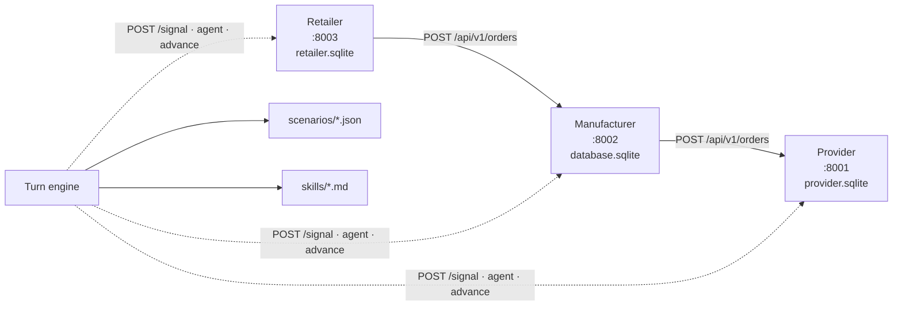

> **How to render to PDF:**
> `pandoc docs/report.md -o docs/report.pdf --filter mermaid-filter \`
> `   --pdf-engine=xelatex`.
> Charts are referenced from `reports/holiday-rush/` and `reports/calm-vs-holiday/`,
> produced by `analyze_sim.py` and `compare_scenarios.py` respectively.
> **Before submitting**, replace every `<...>` placeholder with your own
> observations from the actual runs. The PDF brief is explicit: "if your
> report reads like it could have been written by someone who never watched
> a run, it is not good enough."

# 1. System architecture

## 1.1 Three services, one shared world

Three FastAPI apps with independent SQLite databases. They never read each
other's storage; the only communication is REST. A turn engine sequences
them every day: it pushes today's market signal, generates customer demand,
runs each role's agent (downstream first), and advances all three.

## 1.2 Data models

Each app exposes its own ER. The shared shapes are:

- `products` + (provider-specific) `pricing_tiers` or (factory) `bom` +
  `suppliers` + `inventory`.
- An order type per app (`Order`, `SalesOrder` / `ManufacturingOrder` /
  `PurchaseOrder`, `CustomerOrder` / `PurchaseOrder`) with an explicit state
  machine `pending → confirmed → in_progress → shipped → delivered`.
- `events` — append-only audit log.
- `sim_state` — singleton with `current_day`.
- `signal_state` — singleton with today's modifiers (added Week 8).
- `metrics` — one snapshot row per `(sim_day, product_id)`, written at the
  end of every `advance_day` (added Week 8). This is what
  `analyze_sim.py` reads.

## 1.3 Turn engine — order of operations

1. **Resolve today's signal** from active scenario events. When two events
   overlap, modifiers compose by `max` (for `demand_modifier` and
   `lead_time_modifier`) or `min` (for `supply_modifier`). I chose
   max/min over multiplication so a Black-Friday-meets-Christmas overlap
   does not produce 7.5x demand spikes that aren't in any single event.
2. **Broadcast the signal** to each app via `POST /api/v1/signal`.
3. **Generate customer demand** and POST it to each retailer.
4. **Run each role's agent** in the order retailer → manufacturer → provider.
   Downstream first so the retailer's purchase orders land before the
   manufacturer plans, and the manufacturer's POs land before the provider
   ships.
5. **Advance every app's day** in the same downstream-first order.
6. **Aggregate and log a one-line summary** by calling
   `GET /api/v1/day/summary` on each retailer.

## 1.4 How market signals flow

The provider's `place_order` reads `SignalState.lead_time_modifier` to
inflate `expected_delivery_day`. The other two apps store the signal for
observability (and so agent prompts see consistent modifiers across the
day). `price_sensitivity` is a string hint forwarded only to the retailer.

# 2. Agent design

Three skill files, one per role, under `skills/`. Each contains: a short
role statement, an enumerated CLI command list, a numbered decision
framework, a DO-NOT section, and a market-signal interpretation guide. The
PDF brief is firm about this: skills are the *contract* with the LLM. If the
agent does something stupid, fix the skill.

## 2.1 Summary of each skill

- **Provider manager** — restocks below 50% of starting level, raises top
  tier 5–10% on shortage, lowers it 5–10% on overstock, never above 15%/day.
- **Manufacturer manager** — releases pending sales orders when materials
  exist, orders parts when stock drops below ~2 days of expected consumption,
  raises wholesale 5–10% if orders exceed capacity by >50% for 2+ days,
  lowers if utilisation < 40% for 2+ days, never below cost + 15%.
- **Retail manager** — fulfills from stock or backorders, reorders when
  stock < 3 days of recent demand, raises retail 5% when stock is short,
  lowers 5% when 5+ days of supply pile up, never below wholesale + 20%.

## 2.2 Design decisions I made (and the ones I had to revisit)

- **<Decision 1>** — `<short description and why>`. After the first
  volatile run, the agent `<what happened>` so I `<what I rewrote>`.
- **<Decision 2>** — `<short description and why>`.
- **<Decision 3>** — `<short description and why>`.

## 2.3 What the agents are good at vs bad at

- **Good at**: `<e.g. picking which supplier to call when the catalog is
  small and the difference is obvious>`.
- **Bad at**: `<e.g. anticipating compounding events — when chip shortage
  arrives at the same time as Christmas, the agent reacted to one of them
  only>`.

# 3. Simulation results

## 3.1 Volatile run — `scenarios/holiday-rush.json`

25 days. Events: `normal` (days 1–10), `black_friday` (11–13, demand×3,
high price sensitivity), `chip_shortage` (14–20, supply×0.4, lead_time×2),
`christmas_season` (18–25, demand×2.5, supply×0.6). Days 18–20 overlap chip
shortage and Christmas — modifiers composed by max/min as described.

`<2–4 sentences. What happened on day 11 when the demand triple landed?
Did the manufacturer's parts stock collapse on day 14 when chip shortage
hit? Was the retailer's printer shelf empty for any stretch? Cite specific
days.>`

`<2–4 sentences. Did the retailer manage to keep retail above wholesale+20%?
Did the provider crank top-tier prices during the chip shortage? Were the
adjustments smooth or jagged?>`

`<2–4 sentences. What share of orders backordered on each spike day? Were
backorders eventually fulfilled, or just lost? Did the fulfillment rate
recover after the chip shortage ended?>`

### 3.1.1 Bullwhip moment

`<Describe the specific day where a small demand variance at the retailer
amplified upstream — e.g. retailer's reorder was N units, manufacturer's
purchase to provider was M units, M >> N. Quote the numbers.>`

### 3.1.2 Cause of the worst stockout

`<Proximate cause: whose decision blocked fulfillment. Root cause: which
earlier decision (skill quirk, missing signal interpretation, lead-time
miscalculation) made the proximate one inevitable.>`

## 3.2 Calm run — `scenarios/calm-market.json`

25 days, demand stable. Used as the control group.

`<Briefly contrast: did the manufacturer's parts stock hold steady? Was the
retailer's reorder cadence regular? Did prices drift or stay flat?>`

## 3.3 Side-by-side comparison

`<One paragraph comparing the runs. What did the agents do under stress
that they did not do under calm? Is that a success (they adapted) or a
failure (they panicked)? Where did the system as a whole prove robust, and
where did it fail to absorb the shock?>`

## 3.4 Emergent behaviour

`<Pick one or two emergent behaviours and explain them in causal-chain
form. Examples: bullwhip; price-wars-to-the-floor; a stockout cascade. Do
not hide unexpected behaviour — the PDF wants it explained.>`

# 4. Vibe-coding reflection

`<3–5 paragraphs. How did you use Claude Code across the three weeks?
What worked (e.g. PRD-first iteration; tight skill files keep the agent
predictable). What didn't (e.g. agent ambiguity on edge cases; debugging a
buggy plumbing fix is harder than writing it).>`

`<The one thing you would redesign if you started over: ...>`
